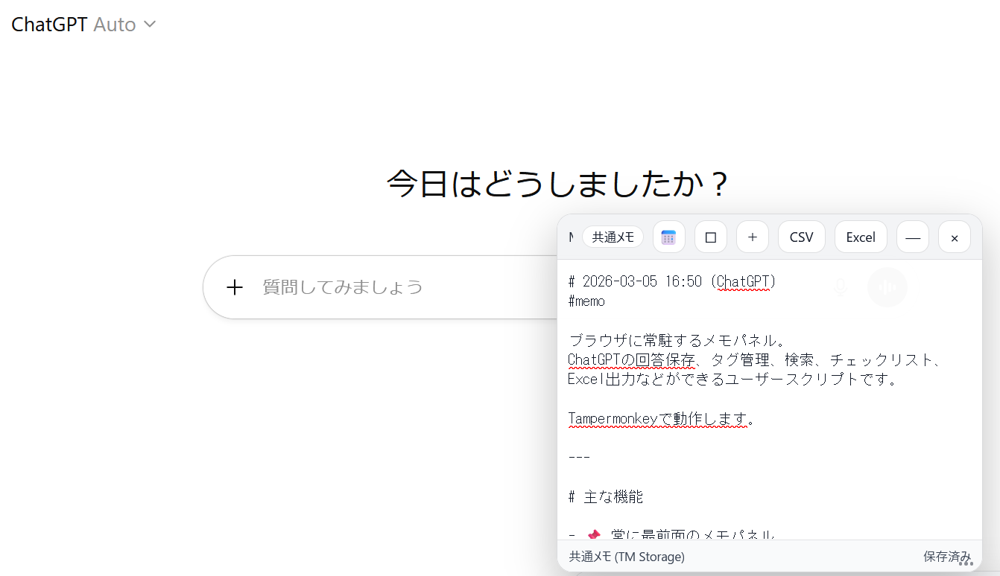

# Memo Panel Ultra

ブラウザに常駐するメモパネル。
ChatGPT回答の保存、タグ管理、検索、チェックリスト、Excelエクスポートなどができるユーザースクリプトです。

Tampermonkeyで動作します。

---

## Screenshot

ChatGPT画面にメモパネルを表示できます。

---

## 主な機能

* 📌 常に最前面のメモパネル
* 📝 新規メモ作成
* 🏷 タグ管理
* 🔍 メモ検索
* ☑ チェックリスト
* 📅 自動日付挿入
* 💾 自動保存
* ⌨ `Ctrl + S` 保存
* 🧠 ChatGPT回答 → ワンクリック保存
* 📊 Excel / CSV エクスポート
* ☁ Tampermonkeyクラウド同期対応

---

## インストール

### ① Tampermonkeyをインストール

[Tampermonkey公式サイト](https://www.tampermonkey.net/)

Chrome / Firefox / Edge 対応

---

### ② スクリプトをインストール

以下をクリック

[Memo Panel Ultra をインストール](https://raw.githubusercontent.com/metaco4989/memo-panel-ultra/main/memo-panel-ultra.user.js)

Tampermonkeyが開きます。
`Install` を押してください。

---

## 使い方

### メモ作成

右上の「＋」ボタンで新規メモを作成。

---

### メモ構成

* 📅 日付
* タイトル
* 本文
* タグ

---

### チェックリスト

* [ ] タスク
* [x] 完了

---

### ChatGPT回答保存

ChatGPTの回答に表示される

`Send to Memo`

ボタンをクリックするとメモに保存されます。

---

### エクスポート

メニューから

`Export CSV`

を押すとExcelで開けるファイルを出力します。

---

## 動作環境

* Firefox
* Chrome
* Edge

Tampermonkey必須

---

## ライセンス

MIT License

---

## 作者

metaco4989
